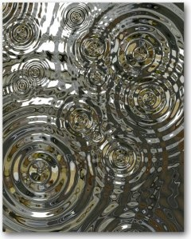
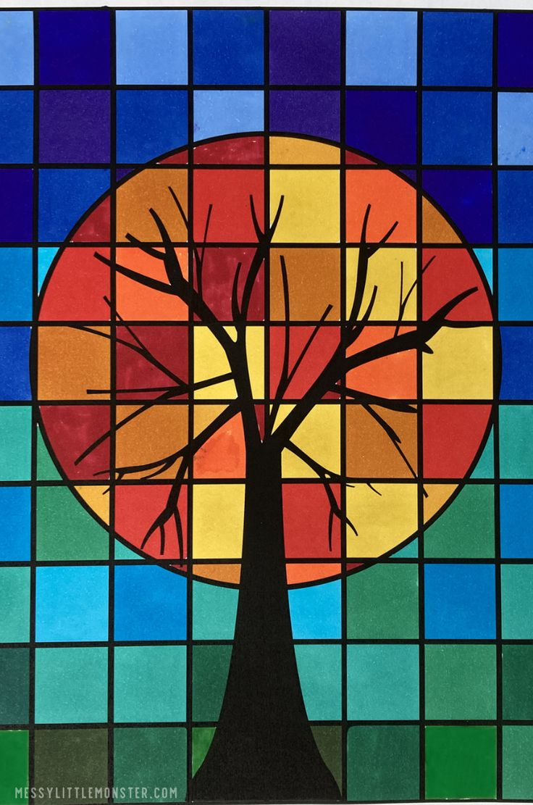

# Idea9103-final-zeli8353
## Inspiration:

### Ripple art is an abstract concept, starting from the centre of a circle and spreading outward the radius of the circular ripple pattern at intervals of increasing in turn. There is order in the chaos, and when the ripples are gradually reduced, it is a process for people to find order and calm in the chaos. Its fluidity and movement make people feel the loss of time and life. Create balance in unbalanced compositions and color deviations. To find balance in the imbalance, chaos produces a moment of order and calm, inspiring emotional appeal in extreme fluctuations.
## **Instructions for use**:
### After running, click on the screen, and the degree of change will change according to the time of clicking, and the greater the time of clicking, the greater the degree of change. When you release the mouse, the animation will begin, and the picture will gradually change to the original state.
